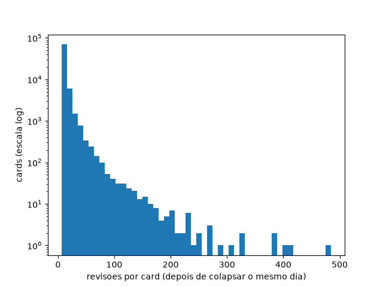
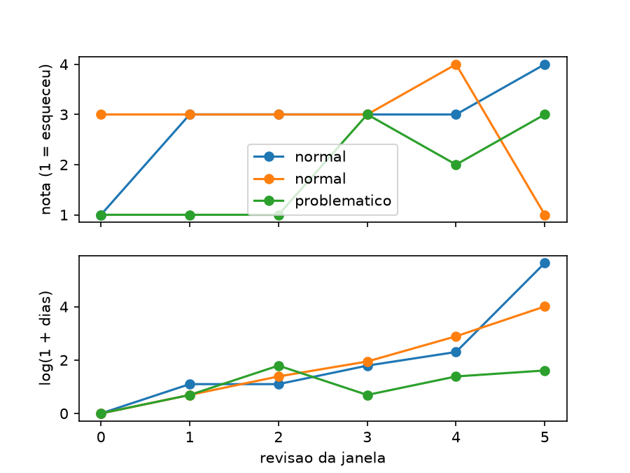

etapa 0: base comum

gerado com `uv run python -m fs.data --n-users 500` em 38.4 min
dataset `open-spaced-repetition/anki-revlogs-10k` @ `75299740cff0` . seed 2903 . N = 6, H = 180 dias, L = 2, teto = 200.

usuarios por split (com algum card) => treino 274 . val 93 . teste 96
usuarios sem nenhum card elegivel => 37
revisoes brutas baixadas => 37,439,493
cards elegiveis antes do teto => 1,406,565 (top-2 usuarios: 5%)
cards elegiveis por usuario => mediana 734 . p90 7819 . max 37761
cards apos o teto => 78,751
prevalencia de card problematico no treino (L = 2) => 11.0%
robustez no treino: L = 1 . L = 3 => 22.5% . 6.3%

